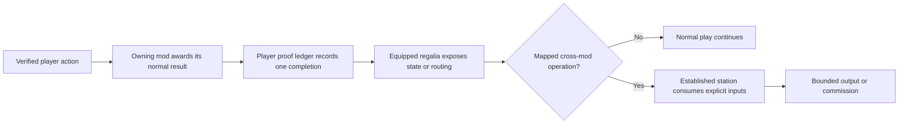
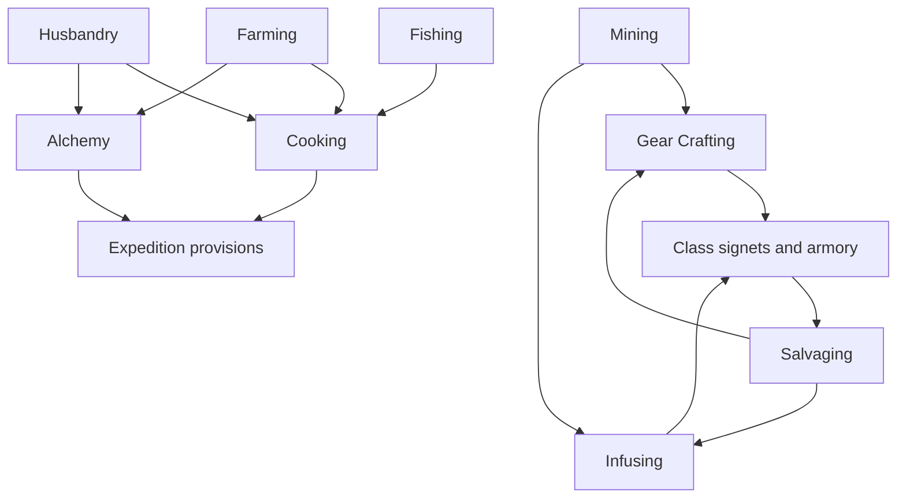

# The Guild Regalia

**Curios, class and profession integration specification — 2026-09-04.**

**Build status:** the 63-item presentation and registration pass is `static validated`.
`tools/gen_curios.py` now emits the textures, models and slot tags; the user requested existing
texture/PIL work first, bringing phase 6 presentation forward. The integration contract below
remains planned: no recipes, effects, profession proof or native signet gear lifecycle is claimed.
See `tools/curios_manifest.json` and `tools/curios_review.png` for the built roster and visual review.

This system adds **63 elven Curios**: 36 class pieces for the six native Mine and Slash classes and
27 trade cuffs for its nine native professions. It connects those pieces to 46 useful wearables
already installed in the pack. It does not replace a profession level, native station, recipe,
resource system or existing Curio effect.

The installed-jar inventory is reproducible. It found **147 wearable item IDs**, of which **114 are
functional** and 33 are Botania cosmetics, across **14 Curios slot types loaded by the last headless
run**. The exact item and slot evidence is in [`curios/INSTALLED_CURIOS.md`](curios/INSTALLED_CURIOS.md);
the machine-readable suite is [`curios/curio_suite_catalog.json`](curios/curio_suite_catalog.json).

## 1. The integration contract

The Curio observes an action that the owning mod has already accepted. It can explain that action,
route its real outputs, or unlock a bounded follow-up at another established station. It never
claims an attempted action as proof and never produces a second copy of the native reward.

Every adapter follows five rules:

1. **One transaction owns each reward.** Mine and Slash awards its own XP and materials. Curios do
   not repeat the award.
2. **Native authority remains final.** A cuff cannot raise a profession, waive a station, learn a
   class, bypass a pinnacle unlock or convert one mod's mana into another's.
3. **Automation produces goods, not personal proof.** A Create line, colony worker, dispenser,
   fake player or summoned creature can prepare inputs. The credited profession action must still
   be one explicitly supported by its owning system.
4. **Integration is explicit.** Cross-mod recipes name their inputs, costs, owner and result.
   Similar item names or tags do not silently confer XP.
5. **Existing Curios remain complete items.** A supported anchor keeps its native recipe, cost,
   slot and effect. The new regalia can read its state or open a compatible operation; it does not
   absorb or imitate it.

## 2. Slots and loadout rules

No new slot type and no slot-capacity increase is planned. The design uses slots already reported
by the installed Curios data.

| Family | Slot | Active rule | Purpose |
|---|---|---:|---|
| Class signet | `ring` | Up to two | A normal Mine and Slash jewelry soul biased toward the matching class; two supports the native dual-class model |
| Class emblem | `necklace` or `charm` | One total | Fixed class-state display and the class's bounded cross-mod handshake |
| Profession cuff | `bracelet` | One | Fixed trade workflow, proof display and commission controls |

A signet only responds when its class is active. It does not grant that class. Two signets may
serve a dual-class build, while an installed ring such as a Band of Mana or Ring of Dexterous
Motion competes for the same real capacity. No progression step requires an optional anchor to be
equipped at the same time as both class signets.

Only one profession cuff can be active. Changing cuffs changes the visible workflow, not the
player's stored profession progress. This keeps the interface legible and prevents nine passive
profession effects from accumulating.

The current static data suggests expanded ring capacity, but player capability assembly has not
yet been observed. Implementation begins with a live probe of ring, necklace, charm and bracelet
capacity on a fresh and existing character. The design does not assume a capacity until that probe
passes.

## 3. Three ranks, one native progression

Each family has three crafted ranks. Rank determines the quality of the interface and the breadth
of the permitted handshake. It is not another XP bar.

| Rank | Campaign gate | Embedded frame | Native recipe tier | Function |
|---|---:|---|---:|---|
| Apprentice | Era II | Quickened Palebloom | 0 | Eligibility, action state and missing-requirement visibility |
| Guild | Era V | Elementium Core | 2 | Logistics, prepared-input routing and one established cross-mod station handshake |
| Master | Era VIII | Rimebound Lattice | 4 | A bounded secondary loop, batch confirmation or commission control |

Era X may add Crown Filament trim and a visible grandmaster commission seal. It does not add a
fourth mechanical rank. A high-rank item may be traded, but every active effect is capped by the
wearer's native profession tier and campaign gates.

The item stores its rank, appearance and attunement. A player capability stores action proof and
milestone eligibility. Trading a cuff transfers the crafted object without transferring another
player's proof. There is no soulbinding requirement.

## 4. Class regalia

Each class receives three signets and three emblems. The signet is built on the native Mine and
Slash ring gear type, so its rarity, level, affixes, sockets and soul lifecycle stay within the
normal MMO gear system. The emblem carries fixed utility and state; it is not another random-stat
package.

### Thornwarden — Warrior

**Pieces:** Thornwarden Signet and Greatbole Torque (`necklace`).

**Verified class events:** successful shield block, Taunt hit, Charge arrival and melee skill hit.
The apprentice pieces show guard state, current threat target and the next eligible Bough charge.
At guild rank, a successful block marks one attacker and the next Warrior threat skill consumes
that mark for control utility. It does not create an extra damage hit. At master rank, the torque
and Tectonic Girdle can share knockback-resistance feedback so resisted movement arms utility.

**Installed anchors:** Tectonic Girdle, Cloaks of Balance and Virtue, Amulet of Wrath and Ring of
Odin. Odin remains a relic and is never copied, consumed, or required. The suite adds no passive
damage reduction or extra-heart package.

### Waywatcher — Hunter

**Pieces:** Waywatcher Signet and Wolfleaf Token (`charm`).

**Verified class events:** ranged skill shot, owned trap placement and trigger, spirit-wolf state,
and a successful Dexterous Motion dodge. Apprentice rank shows the ammunition source, trap owner,
wolf state and recoverable projectiles. Guild rank gives the Supplementaries Quiver and recovered
arrows one visible routing path. Master rank allows a native dodge to prime one short trap-control
window. Damage and cooldown remain on the skill and soul.

**Installed anchors:** Quiver, Ring of Dexterous Motion, Ring of Far Reach, Sojourner's Sash and
The Spectator. The suite creates no arrows, free range, permanent invisibility or trap resets.

### Leyweaver — Sorcerer

**Pieces:** Leyweaver Signet and Leyglass Prism (`charm`).

**Verified class events:** Fire skill, Cold skill, golem state and completed teleport. Apprentice
rank displays Mine and Slash mana, Ars Source access and Iron's spell mana as separately owned
resources. Guild rank lets prism attunement narrow future signet crafting toward fire, cold or
confluence through explicit recipe branches. Master rank allows alternating valid Fire and Cold
Mine and Slash skills to arm a confluence utility window.

**Installed anchors:** Ars mana boost and regeneration amulets, Focus of Block Shaping, Iron's
affinity, cast-time and recovery rings, and Botania's Band of Mana. The suite performs no resource
conversion, duplicate cooldown reduction or cross-mod spell-power multiplication.

### Rootspeaker — Shaman

**Pieces:** Rootspeaker Signet and Rainseed Torque (`necklace`).

**Verified class events:** totem summon and expiry, restoration skill, thorn-garden hit and
Lightning skill hit. Apprentice rank shows owned totems, remaining duration, valid restoration
targets and local Aura condition when an ocular is equipped. Guild rank makes Aura storage and
summoning tools visible as context for Rootspeaker actions. Master rank lets restoration and storm
actions around the same active totem arm one renewal utility window.

**Installed anchors:** Aura Cache and Trove, Environmental Ocular, Band of Aura, Focus of Summoning
and Familiar Ring. Totems generate no free Aura or Source, do not become immortal, and cannot form
an autonomous healing loop.

### Duskkeeper — Warlock

**Pieces:** Duskkeeper Signet and Mourning Nameleaf (`charm`).

**Verified class events:** curse application and expiry, summon creation and expiry, damage-over-
time kill and named familiar presence. Apprentice rank shows curse ownership, summon timers and
whether timeout or death removed a summon. Guild rank records bounded memory marks from valid
cursed or summoned encounters for explicit Occultism cross-binding recipes. Master rank can read
the timeout state supplied by a Conjurer's Talisman without repeating its cooldown exception.

**Installed anchors:** Conjurer's and Greater Conjurer's Talismans, Wicked Bone Ring, Familiar Ring,
Cloak of Sin and Invisibility Cloak. The suite grants no extra ricochet, inherited invisibility,
free summon reset or repeatable resummon loot.

### Dawnsinger — Minstrel

**Pieces:** Dawnsinger Signet and Dawncourt Brooch (`necklace`).

**Verified class events:** song cast, healing applied to another player, Power Chord hit and a
resource-support effect applied. Apprentice rank shows song radius, eligible party members, active
song family and strongest-effect conflicts. Guild rank lets the brooch classify a song as healing,
control or resource support so installed utility can react through one clearly owned effect.
Master rank lets distinct songs build a short ensemble cadence; repeating one song cannot farm
stacks.

**Installed anchors:** Charm of the Diva, Band of Aura, Ars mana-regeneration amulet, Amulet of
Concentration and the Cloaks of Balance and Virtue. Songs grant no free crafting output or
profession XP to their recipients.

## 5. Profession cuffs

Every cuff provides the same three layers: apprentice visibility, a guild cross-mod handshake and
a master workflow control. The native action named below is the only event that may record proof.

### Bloom Delver — Mining — Strata Cuff

- **Proof:** the player mines a naturally generated, explicitly mapped ore, crystal or bloom.
- **Apprentice:** show eligible block, mining tier, intended depth band and whether provenance is
  natural, placed or renewable.
- **Guild:** surface eligible drops through The Spectator/Combined Goggles and route real drops to
  an available bag or Aura-backed expedition cache without multiplying them.
- **Master:** seal a surveyed vein as a commission target and reconcile its actual delivered count.
- **Anchors:** Ring of the Mantle, The Spectator, Otherworldly Engineer's Goggles, Aura Cache.
- **Guardrail:** placed blocks, Silk Touch loops, machine breaks, fake players and automation award
  no personal proof or additional drop.

### Grove Tender — Farming — Seedkeeper Cuff

- **Proof:** the player harvests a mature, explicitly mapped crop at a verified growth stage.
- **Apprentice:** show maturity, mapped produce family, replant requirement and active commission.
- **Guild:** recognize Ars, Botania, Farmer's Delight or colony-prepared inputs only when a named
  native Farming recipe or harvest adapter owns the transaction.
- **Master:** maintain a cultivar ledger for diverse mature harvests and fulfill horticultural
  commissions from the real harvested quantities.
- **Anchors:** Environmental Ocular, Aura Cache, Ring of Far Reach, Benevolent Goddess' Charm.
- **Guardrail:** growth acceleration may grow crops; only the credited harvest records proof.
  Immature break, placed-log abuse and dispenser harvest do not qualify.

### Tidekeeper — Fishing — Tideledger Cuff

- **Proof:** the native fishing event accepts a catch for the player.
- **Apprentice:** show catch family, biome/water eligibility and current diversity ledger.
- **Guild:** route eligible fish into a Cooking preparation list while retaining the single caught
  stack as the only output.
- **Master:** issue mixed-catch provision commissions that reward variety, not raw catch spam.
- **Anchors:** Ring of Chordata, Ring of Far Reach, Aura Cache.
- **Guardrail:** no second catch, autonomous-fishing proof, copied treasure roll or extra native XP.

### Wildward — Husbandry — Herdsong Cuff

- **Proof:** the player completes valid native breeding between an eligible adult mapped pair.
- **Apprentice:** show parent readiness, lineage cooldown and husbandry commission eligibility.
- **Guild:** expose familiar, summon and animal-calming context without allowing those entities to
  impersonate the credited breeder.
- **Master:** track diverse healthy herds for breeding-stock commissions and veterinary alchemy
  requests.
- **Anchors:** Charm of the Diva, Familiar Ring, Focus of Summoning, Environmental Eye.
- **Guardrail:** slaughter, child growth, dispenser feeding, summoned creatures and repeated event
  callbacks do not record breeding proof.

### Memory Reclaimer — Salvaging — Reclaimer Cuff

- **Proof:** a soul-bearing eligible item completes the native salvage-station transaction.
- **Apprentice:** preview source soul identity, protected NBT, expected salvage family and items
  that will be destroyed.
- **Guild:** stage marked items from the Master Backpack, satchel or storage accessor into a queue;
  the native station still consumes each item.
- **Master:** batch-confirm a commission with a full before/after ledger and stop on any mismatch.
- **Anchors:** Rings of Magnetization, The Spectator, Surprisingly Substantial Satchel, Master
  Backpack, Storage Accessor.
- **Guardrail:** no automatic salvage, rarity reroll, source-soul duplication or recovery of the
  recipe's unique finalization reagent.

### Armsinger — Gear Crafting — Forge-Measure Cuff

- **Proof:** a native Gear Crafting recipe completes at its station.
- **Apprentice:** show frame family, required profession tier, output gear type, soul tier and
  missing material.
- **Guild:** combine Create/Otherworld goggles and the Manaseer Monocle as preparation views for a
  work order; the final native recipe remains the only craft and XP owner.
- **Master:** issue class armory commissions and select a class-crystal profile that narrows valid
  recipe branches without guaranteeing rarity or affixes.
- **Anchors:** Engineer's Goggles, Otherworldly Engineer's Goggles, Manaseer Monocle, Master
  Backpack.
- **Guardrail:** no free material, price discount, rarity increase, arbitrary soul creation or NBT
  loss during frame finalization.

### Runeweaver — Infusing — Infuser Cuff

- **Proof:** a native Infusing/Enchanting recipe completes at its station.
- **Apprentice:** show compatible affix family, socket/rune state, owning resource and destructive
  choices before confirmation.
- **Guild:** Ars discounts, Iron affinity and Botania mana retain their native scopes; prepared
  crystals select only explicit Mine and Slash recipe branches.
- **Master:** a costly recipe may protect one selected affix family during an eligible reroll while
  consuming the normal orb and an added reagent.
- **Anchors:** Ars lesser/greater discount rings, Iron affinity ring, Bands of Mana and Aura, Ars
  mana-regeneration amulet.
- **Guardrail:** no free reroll, cross-resource discount, copied enchantment, maximum-affix promise
  or hidden NBT destruction.

### Hearthkeeper — Cooking — Hearthcord Cuff

- **Proof:** a native Cooking recipe or explicitly mapped Farmer's/Miners Delight preparation
  completes for the player.
- **Apprentice:** show meal family, MMO food category, active-food conflict, servings and missing
  sides.
- **Guild:** use mapped dishes as named inputs to native Cooking recipes rather than silently
  awarding profession XP for every ordinary craft.
- **Master:** assemble party platters by dividing the same total portions into a commission output.
- **Anchors:** Surprisingly Substantial Satchel, Master Backpack, Aura Cache.
- **Guardrail:** no passive feeding, serving multiplication or duplicate food buffs. Overlapping
  MMO foods use the strongest eligible effect.

### Dewbrewer — Alchemy — Dewglass Cuff

- **Proof:** a native Alchemy recipe or explicitly mapped botanical/Ars preparation completes for
  the player.
- **Apprentice:** show effect family, potency/duration branch, active conflict and whether the
  operation preserves container NBT.
- **Guild:** join botanical brews, Ars flasks and Mine and Slash potions through explicit conversion
  recipes with separate resource costs.
- **Master:** choose duration or potency at equal budget, or bind an eligible brew into a Blood
  Pendant through a validated NBT-preserving operation.
- **Anchors:** Alchemist's Crown, Tainted Blood Pendant, Amethyst Resonance Charm, Aura Cache, Ars
  mana-regeneration amulet.
- **Guardrail:** no instant-consumption duplication, permanent buff copy, free container, effect
  stacking exploit or generic-potion profession XP.

## 6. The profession economy

The cuffs create demand between trades instead of making each trade self-contained.

Mining supplies frames and infusions. Farming, fishing and husbandry supply explicit provision and
brew recipes. Salvaging returns bounded common materials to Gear Crafting and Infusing. Gear
Crafting makes class signets, emblems and cuffs as tradeable goods. Infusing performs attunement
and protection operations. Cooking and Alchemy provision expeditions, whose unwanted soul-bearing
gear returns to Salvaging.

Commissions are item-backed requests with an owner, requested item/tag, exact quantity, permitted
quality band, expiration and escrowed reward. The cuff helps author and inspect them. Completion is
based on delivered items or verified native transactions, never a chat claim or client-only state.

## 7. Crafting and item identity

- All 63 pieces use the pack's embedded frame ladder: Quickened Palebloom, Elementium Core and
  Rimebound Lattice at the three mechanical ranks.
- Class signets are native Mine and Slash gear outputs. They accept ordinary soul application,
  rarity, level, sockets and salvage behavior after one vertical-slice prototype proves the ring
  lifecycle.
- Class emblems and profession cuffs use fixed behavior and explicit state. They do not roll combat
  affixes and do not become a second source of MMO stats.
- Existing anchor Curios are never ingredients after they have accumulated charge, stored items,
  a brew, a familiar or other NBT. Integration checks for a simultaneously equipped eligible item
  or consumes a clean recipe ingredient only where that mod already expects it.
- Relics and severe power pieces remain optional: Rings of Loki, Odin and Thor, Andwari and Cursed
  Andwari Rings, Flügel Tiara and Ring of Last Chance are never mandatory or consumed for
  progression.

## 8. Proof, attribution and persistence

The server owns proof. The minimum record is player UUID, native profession/class ID, action ID,
server tick, dimension, relevant item/block/entity ID, recipe or skill ID, result count and a
transaction nonce. Only the small totals needed for milestones and commissions persist; raw events
expire after reconciliation.

For gathering, provenance distinguishes generated blocks from player-placed and renewable blocks.
For crafting, the completed native recipe and consumed-input snapshot own proof. For combat, the
Mine and Slash skill, attacker, target and outcome own proof. For breeding and fishing, the native
accepted event owns proof. Relogging, death, dimension travel, cuff swaps and trading cannot replay
a transaction nonce.

Client displays are advisory. If the HUD and server disagree, the server result wins and the cuff
shows the reason: wrong tier, wrong owner, automation, cooldown, missing station, invalid target,
unmapped recipe or already-consumed transaction.

## 9. Delivery sequence

| Phase | Deliverable | Acceptance |
|---|---|---|
| 0 — capability proof | Live slot/capacity report for new and existing characters; Curios equip validator prototype | Ring, necklace, charm and bracelet behavior observed across relog and death |
| 1 — vertical slice | Warrior apprentice signet + Greatbole Torque; Mining cuff at all three ranks | Class gate, one natural-ore proof, placed-block rejection, trade cap and native ring soul lifecycle all pass |
| 2 — gatherers | Farming, Fishing and Husbandry cuffs | Each records exactly one verified action and rejects its automation/replay cases |
| 3 — producers | Salvaging, Gear Crafting, Infusing, Cooking and Alchemy cuffs | Input/NBT ledgers reconcile; native station awards once; no positive conversion loop |
| 4 — class suites | Remaining five signet/emblem families | Single and dual-class loadouts, anchor competition and all class event ownership pass |
| 5 — multiplayer | Item-backed commissions, party displays and server load | Trade works across players; no proof transfer, team leak, offline duplication or client trust |
| 6 — presentation | 63 transparent inventory textures and class/profession review sheets | Literal RGBA transparency, enclosed openings and silhouette checks pass before import |

Exact percentages, cooldowns, ranges and costs belong to the balancing phase after these event paths
exist. The first implementation measures profession XP per minute, action frequency, slot pressure,
resource consumption and commission throughput before assigning numerical bonuses.

## 10. Required acceptance cases

- Fresh and existing characters receive the intended slots without duplicates after relog.
- Death, keep-inventory and `keepCurios` behavior preserve or drop each item exactly once.
- A class signet is inert for a character without that active class; dual-class builds activate no
  more than two.
- A traded master cuff is capped by the buyer's native profession tier and carries no seller proof.
- Unequipping during an action cannot claim or lose the same transaction twice.
- Placed ores/crops, fake players, deployers, colony workers and summoned entities cannot grant
  personal gathering proof.
- Salvage, infusion, brewing and food operations preserve every required NBT field and return each
  container exactly once.
- Existing anchor effects remain unchanged with and without the matching regalia.
- Mana, Source, Aura and Iron's spell mana remain separate; no circular conversion is profitable.
- Party effects respect team, range, target eligibility and strongest-effect rules.
- A closed craft/salvage or prepare/finalize loop yields neither positive materials nor unbounded
  profession XP.

The first vertical slice is deliberately narrow because three implementation surfaces still need
runtime proof: Curios per-player slot assembly, Mine and Slash profession/class event access, and
NBT-safe custom station completion. Once those pass, the catalog is designed for generation rather
than 63 hand-written registrations.
