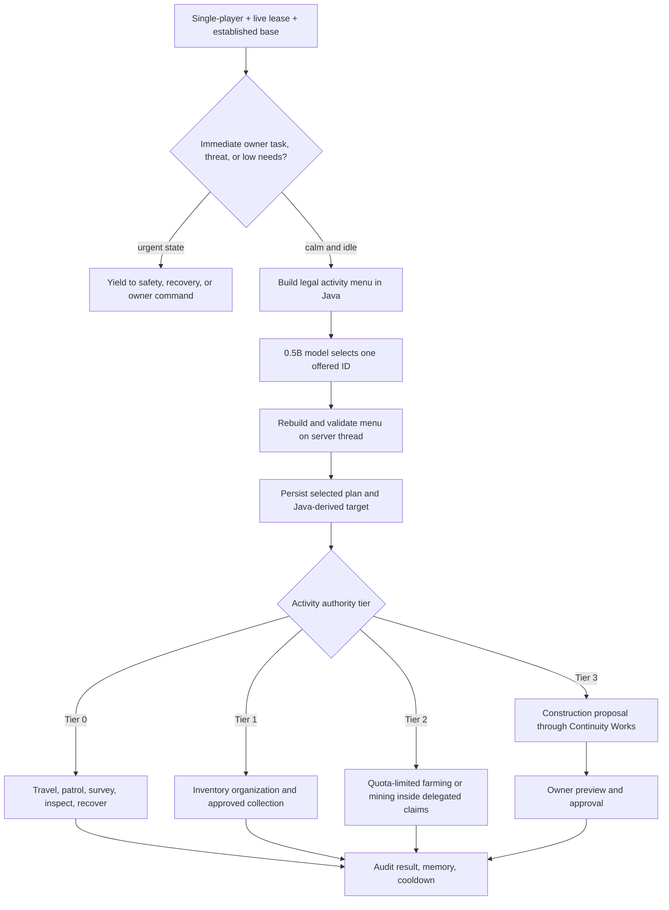

# Autonomous activity implementation map

The companion's self-direction is a slow, bounded planning layer above ordinary movement and below
owner commands. The inference model may choose only an offered activity ID. Java owns eligibility,
targets, claims, inventories, quotas, permissions, execution and audit state.

## Delivery sequence

| Stage | Scope | Safety boundary | Status |
| --- | --- | --- | --- |
| A | Persistent plan, scored menu, inference selection, stale-result rejection | Model returns one ID; restart pauses active travel | Implemented |
| B | Recover at base, patrol claims, survey district, inspect base | No block or inventory mutation; loaded delegated claims only | Implemented |
| C | Inventory organization and dropped-item collection | Visible inventory; item/entity identity revalidated | Planned |
| D | Farming | Crop allowlist, mature-state check, seed reserve, per-cycle quota, delegated claim | Planned |
| E | Mining | Owner policy, block/tag allowlist, tool/durability reserve, light/escape checks, per-cycle quota | Planned |
| F | Autonomous construction | Java site candidates, material manifest, Continuity Works preview, explicit owner approval | Planned |
| G | Production hardening | GameTests, recovery audit, tick/RAM budgets, user controls and telemetry | Planned |

## Universal invariants

- Autonomous work runs only in an integrated single-player server while the current player holds the lease.
- An owner command, active blueprint, threat, invalid dimension, missing claim, unloaded target, low health,
  or expired lease preempts autonomous work.
- The model never authors coordinates, block IDs, quantities, commands, recipes or permission decisions.
- Every world-changing step must be inside the companion's delegated-claim ledger and pass the normal FTB,
  Forge-event, reach, inventory, tool and world-border checks immediately before execution.
- Mining and farming receive small per-cycle and per-day budgets. They stop before exhausting seeds,
  food, tools, storage or safe return capacity.
- Construction remains proposal-driven. Self-direction can request a proposal but cannot approve it.
- No activity may load or generate an unobserved chunk.
- Persisted records are audit data, not permission to resume a stale destructive action after restart.
